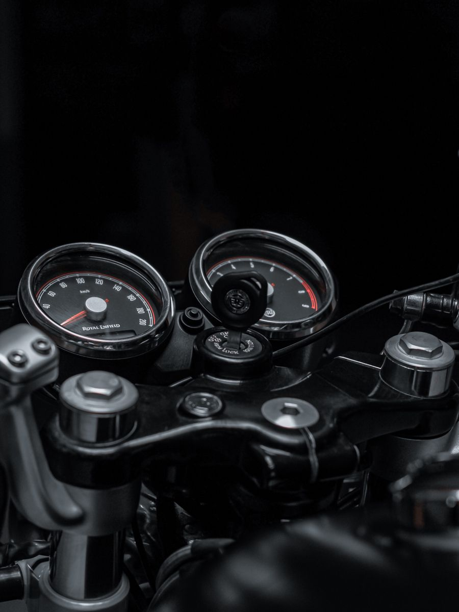

<p align="center">
  
</p>
<div align="center">🚀 INDERASH</div>

<div align="center">

### Full Stack Developer • AI Enthusiast • MERN Stack Learner


</div>

---

<table>
<tr>

<td width="60%">

## 👨‍💻 About Me

```yaml
name: Inderash
role: Full Stack Developer
education: B.Sc CSDA
location: Tamil Nadu, India

currently_learning:
  - React
  - Node.js
  - MongoDB
  - MERN Stack

interests:
  - Artificial Intelligence
  - Full Stack Development
  - Open Source
  - System Design

goal:
  Become a Software Engineer
```

### 🎯 Current Focus

* 🤖 Building AI-powered applications
* 🚀 Developing real-world solutions
* 💻 Mastering MERN Stack
* 📚 Improving DSA & System Design
* 🌱 Contributing to Open Source

</td>

<td width="40%">


</td>

</tr>
</table>

---

## 🛠️ Tech Stack

<div align="center">


</div>

---

## 🚀 Featured Projects

<table>
<tr>

<td width="50%">

### 🤖 CampusFinder AI

AI-powered Lost & Found System

✅ Image Matching
✅ Smart Search
✅ AI Chatbot
✅ Flask Backend

</td>

<td width="50%">

### 🚌 College Bus Tracker

Real-Time GPS Tracking

✅ Live Location
✅ Student Dashboard
✅ Mobile Friendly
✅ Route Monitoring

</td>

</tr>

<tr>

<td width="50%">

### 🏫 College Portal System

Role-Based Management

✅ Authentication
✅ Student Dashboard
✅ Faculty Panel
✅ Admin Controls

</td>

<td width="50%">

### 📊 AI Sentiment Analyzer

Student Feedback Analytics

✅ NLP Processing
✅ Sentiment Detection
✅ Reports & Insights
✅ AI Integration

</td>

</tr>

<tr>

<td width="50%">

### 🗳️ Digital Voting Machine

Secure Voting System

✅ Fingerprint Login
✅ Vote Protection
✅ Database Storage
✅ Authentication

</td>

<td width="50%">

### 🚀 Upcoming Projects

Currently Building

✅ MERN Applications
✅ AI Tools
✅ Portfolio Projects
✅ Open Source Work

</td>

</tr>
</table>

---

## 📊 GitHub Analytics

<div align="center">


</div>

---

## 📈 Activity Graph

<div align="center">


</div>

---

## 🔥 Development Journey

```text
Python              ██████████████████░░ 90%
Frontend            █████████████████░░░ 85%
SQL                 █████████████████░░░ 85%
JavaScript          ███████████████░░░░░ 75%
Backend             ██████████████░░░░░░ 70%
React               ██████████░░░░░░░░░░ 50%
MongoDB             ██████████░░░░░░░░░░ 50%
MERN Stack          ████████░░░░░░░░░░░░ 40%
```

---

## 🌟 Technologies I Work With

<div align="center">


</div>

---

## 🌐 Connect With Me

<div align="center">

<a href="https://github.com/inderash18">

</a>

<a href="#">

</a>

<a href="#">

</a>

<a href="#">

</a>

</div>

---

<div align="center">


</div>

---

<div align="center">

### ⭐ Building the Future, One Project at a Time ⭐

</div>
